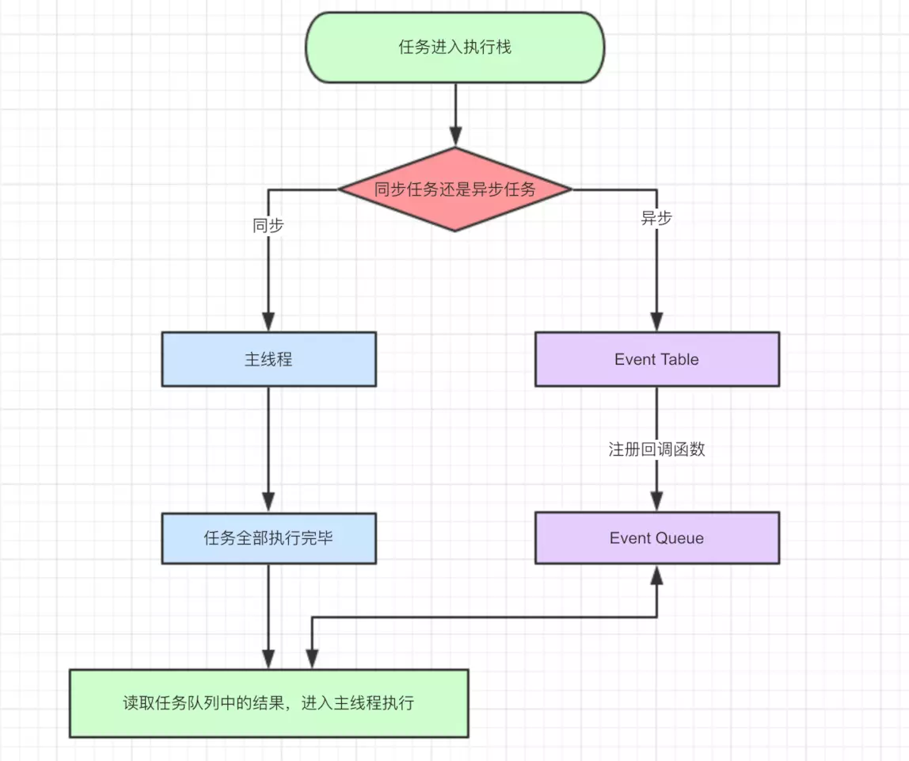

# js异步编程
## 什么是单线程，和异步有什么关系？
定义：同一时间只做一件事
原因：避免DOM渲染冲突，因为DOM渲染的时候，执行JS，如果是并发的情况下，DOM元素本身的渲染样式和JS操作的渲染样式相冲突，浏览器不知怎么渲染。同理两段js渲染的情况下，也可能会造成渲染冲突。
单线程的解决方案就是异步
## 异步的解决方案
事件轮询（event-loop）的原理解决，使用promise,async,await的方法
## 事件轮询（event-loop）
[执行讲解1](https://juejin.im/post/59e85eebf265da430d571f89)  
[事件轮询讲解](https://juejin.im/post/5c3d8956e51d4511dc72c200)
### 1. 宏任务和微任务
* macro-task宏任务：script,setTimeout,setInterval,
* micro-task微任务：process.nextTick,promise
执行一个宏任务，然后执行所有的微任务，再然后执行一个宏任务，在js中script这个整体算一个宏任务，所以主线程执行完成后，执行所有的微任务。
### 2. 同步任务和异步任务

### 3. setTimeout
对于setTimeout是一个异步任务，会去event-table注册,但是因为后面的参数时间限制，所以当后面假设是3秒，3秒过后才将函数放进event-queue中进行js引擎轮询，也就是主线程的任务执行完成了，js引擎存在monitoring process进程，不断的检查主线程执行栈是否为空，一旦为空就去event-queue检查等待被调用的函数。有时候出现很大的延时，原因是在主线程出现sleep这种很长时间的内容，然后3秒过后函数已经放在event-queue中了，但是主线程不为空，就继续等着。就算定时为0,HTML标准规定也是不能立即执行的，最小为4ms
### 4. setInterval
效果和setTimeout一样的，也就是每隔一定时间把注册的函数放入event-queue中，那么很可能看不出事件间隔了
### 5. node和浏览器执行的区别
浏览器：主线程------所有微任务-----一个宏任务-----所有微任务queue------一个宏任务
node：主线程-------所有微任务------所有宏任务-----所有微任务

